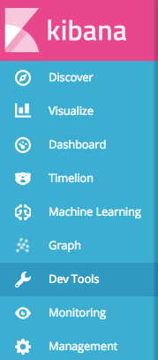

# Elasticsearch Playground

A simple elasticsearch playground packaged in Docker. Includes an Elasticsearch instance and a Kibana instance with [X-Pack](https://www.elastic.co/products/x-pack) pre-installed.

## Requirements

The only requirement is [Docker](https://docs.docker.com/engine/installation/) with Docker Compose. The images required can be built or pulled from the official Docker registry.

## Running

Start in background
```
docker-compose up -d
```

# Accessing

Kibana should be accessible on port `5601` of your Docker host.

If your Docker host is `1.2.3.4`, point your browser to `1.2.3.4:5601`.

> Note: On Docker for Linux and Docker for Mac, your Docker host should be `localhost`.


At the login screen, use the default X-Pack credentials:

* Username: `elastic`
* Password: `changeme`



Click on "Dev Tools" on the sidebar on the left to start playing around!